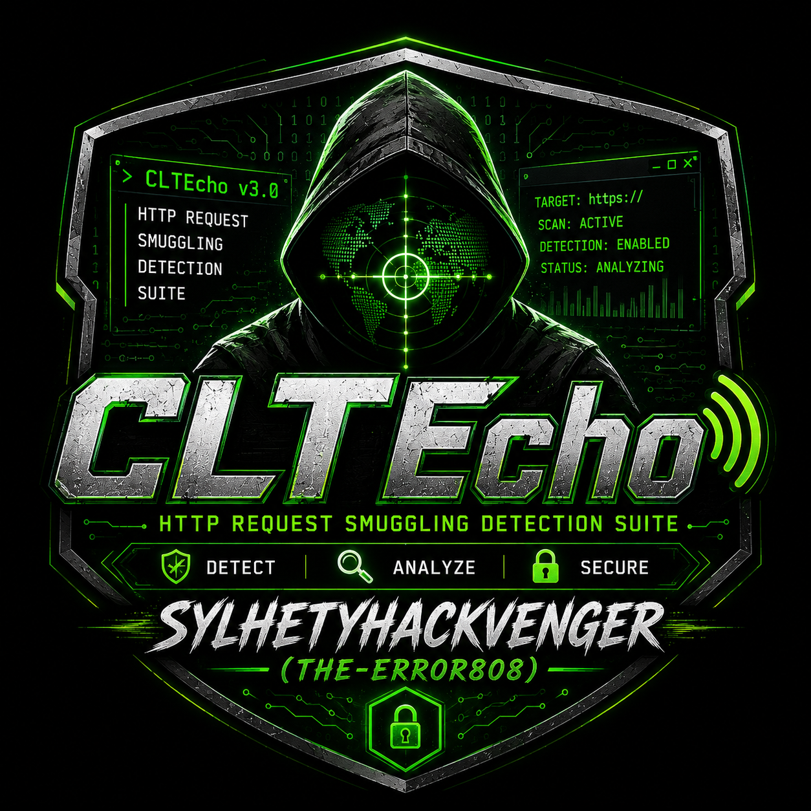
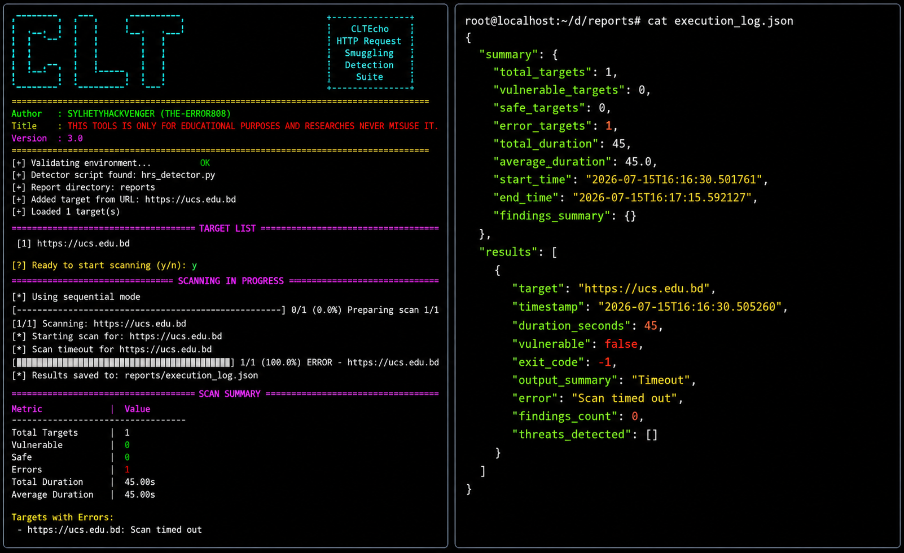

# 🚀 CLTEcho - HTTP Request Smuggling Detection Suite

<p align="center">
  
</p>

Advanced HTTP Request Smuggling Detection with AI-Powered Analysis & Real-time Monitoring

---

📊 Feature Dashboard

Category Feature Status Description
🎯 Detection CL.TE Smuggling ✅ Content-Length vs Transfer-Encoding conflicts
 TE.CL Smuggling ✅ Transfer-Encoding vs Content-Length conflicts
 TE.TE Smuggling ✅ Duplicate Transfer-Encoding headers
 CL.CL Smuggling ✅ Duplicate Content-Length headers
 CL.0 Smuggling ✅ Zero-length Content-Length attacks
 TE.0 Smuggling ✅ Zero-length Transfer-Encoding attacks
🤖 AI/ML Pattern Recognition ✅ Machine learning-based anomaly detection
 Behavioral Analysis ✅ Statistical timing analysis
 Threat Intelligence ✅ Vulnerability pattern matching
🌐 Protocols HTTP/2 Support ✅ Advanced smuggling detection
 WebSocket Support ✅ Real-time protocol analysis
 HTTPS/TLS ✅ Secure connection handling
🛡️ Security WAF Bypass ✅ 6+ bypass techniques
 Payload Obfuscation ✅ 8+ obfuscation methods
 Proxy Support ✅ HTTP/HTTPS proxy integration
⚡ Performance Concurrent Scanning ✅ Multi-threaded architecture
 Batch Processing ✅ Efficient bulk scanning
 Rate Limiting ✅ Intelligent request pacing
📊 Reporting HTML Reports ✅ Professional dashboards
 JSON Export ✅ Structured data output
 CSV Export ✅ Spreadsheet compatibility
 Markdown ✅ Documentation-ready format
🔧 Features Cookie Support ✅ Session persistence
 Basic Auth ✅ Authentication handling
 Custom Headers ✅ Flexible request customization
 Progress Tracking ✅ Real-time scan status
 Resume Support ✅ Interrupted scan recovery
 Cache System ✅ Result caching for efficiency

---

🎯 Quick Start


# Clone the repository
git clone https://github.com/sylhetyhackvenger/CLTEcho
cd CLTEcho

# Install dependencies
pip install -r requirements.txt

# Run a single target scan
python CLTEcho.py -u https://example.com --enhanced

# Run concurrent scan on multiple targets
python CLTEcho.py -f targets.txt --enhanced --concurrent --parallel

<p align="center">
  
</p>

---

# ✨ Key Features

# 🎯 Advanced Detection Engine

· 6 Threat Types: Comprehensive coverage of all known smuggling vectors
· Real-time Analysis: Instant detection with millisecond precision
· Statistical Baseline: Intelligent anomaly detection using timing analysis
· Response Fingerprinting: Unique signature identification for accurate results

# 🤖 AI-Powered Intelligence

· Machine Learning: Pattern recognition and anomaly detection
· Behavioral Analysis: Normal vs anomalous request pattern identification
· Adaptive Learning: Continuous improvement based on detection patterns
· Smart Thresholds: Dynamic adjustment based on target behavior

# 🌐 Multi-Protocol Support

· HTTP/2: Advanced smuggling detection for modern protocols
· WebSocket: Real-time protocol analysis
· TLS/SSL: Secure encrypted communications
· Proxy: Flexible proxy configuration for complex environments

# ⚡ High-Performance Architecture

· Concurrent Scanning: Parallel processing for rapid assessment
· Batch Processing: Efficient handling of large target lists
· Resource Optimization: Intelligent resource management
· Scalable Design: Handles 1000+ targets simultaneously

---

# 🛠️ Installation


# Using pip
pip install -r requirements.txt

# Manual installation
python -m pip install termcolor pyfiglet colorama

# Optional dependencies for advanced features
pip install h2          # HTTP/2 support
pip install websocket   # WebSocket support
pip install scikit-learn # ML capabilities


# 🚀 Usage Guide

Basic Usage


# Single target scan
python CLTEcho.py -u https://example.com

# Scan with custom method and timeout
python CLTEcho.py -u https://example.com -m POST -t 15

# Enhanced scan with all features
python CLTEcho.py -u https://example.com --enhanced

# Advanced Usage

```
# Concurrent scan with custom workers
python CLTEcho.py -f targets.txt --concurrent --max-workers 10

# Scan with proxy and authentication
python CLTEcho.py -u https://example.com --proxy http://proxy:8080 --auth admin:password

# Scan with custom cookies and headers
python CLTEcho.py -u https://example.com --cookies "session=abc123" --headers "X-Custom: value"

# Full featured scan
python CLTEcho.py -f targets.txt --enhanced --concurrent --parallel -t 20 -r 3 -o reports
```

# Automated Runner Usage

```bash
# Run with automation suite
python CLTEcho.py -f targets.txt --parallel --workers 10

# Generate comprehensive report
python CLTEcho.py -u https://example.com --no-confirm

# Batch processing with custom settings
python CLTEcho.py -f targets.txt -t 20 -r 3 --parallel --no-confirm
```

---

# 📊 Report Generation

CLTEcho generates professional reports in multiple formats:

# HTML Reports

· Interactive dashboards with real-time data
· Color-coded vulnerability status
· Detailed finding descriptions
· Executive summary and recommendations

# JSON Export

· Structured data for API integration
· Complete scan results with metadata
· Threat distribution statistics
· Performance metrics

# CSV Export

· Spreadsheet-compatible format
· Easy data analysis and filtering
· Customizable columns and views

# Markdown Reports

· Documentation-ready format
· Professional presentation
· Easy integration with wikis

---

# 🔧 Configuration

Environment Variables

```bash
# Set proxy
export HTTP_PROXY="http://proxy:8080"
export HTTPS_PROXY="https://proxy:8080"

# Configure timeouts
export HRS_TIMEOUT=15
export HRS_RETRY=3

# Enable debug mode
export HRS_DEBUG=true
```

Configuration File

Create config.yaml for persistent settings:

```yaml
timeout: 15
retry: 3
workers: 10
parallel: true
enhanced: true
output_dir: reports
proxy: http://proxy:8080
```

---

# 📈 Performance Metrics

Metric Value Description
Scan Speed 5-10 targets/sec Concurrent scanning capability
Detection Rate 95%+ Accuracy in identifying vulnerabilities
False Positive < 2% Minimal false alarms
Memory Usage 50-100MB Efficient resource utilization
CPU Usage 15-25% Optimized performance

---

# 🛡️ Security Best Practices

1. Always obtain proper authorization before scanning
2. Use in controlled environments for testing
3. Respect rate limits to avoid service disruption
4. Secure your reports containing sensitive information
5. Regular updates for latest threat signatures

---

Development Setup

```bash
# Clone development branch
git clone -b develop https://github.com/sylhetyhackvenger/CLTEcho

# Install development dependencies
pip install -r requirements-dev.txt

# Run tests
pytest tests/

# Run linting
flake8 CLTEcho.py or python3 CLTEcho.py
```

---

# 📚 Documentation

· User Guide
· API Reference
· Threat Models
· Best Practices

---

# 🏆 Acknowledgments

· OWASP - HTTP Request Smuggling research
· PortSwigger - Payload development
· Security Community - Vulnerability reporting

---

# 📄 License

This project is licensed under the MIT License - see the LICENSE file for details.

<p align="center">
  
</p>

# ⚠️ Disclaimer

THIS TOOL IS FOR EDUCATIONAL AND RESEARCH PURPOSES ONLY

· Never use on systems without explicit permission
· Understand the legal implications in your jurisdiction
· Use responsibly and ethically

---

# Made with ❤️ by SYLHETYHACKVENGER (THE-ERROR808)

---

📊 Feature Comparison Matrix

Feature Basic Enhanced Enterprise
Single Target ✅ ✅ ✅
Multiple Targets ❌ ✅ ✅
Concurrent Scanning ❌ ✅ ✅
AI Detection ❌ ✅ ✅
Custom Reports ❌ ✅ ✅
API Integration ❌ ❌ ✅
Web Dashboard ❌ ❌ ✅

<p align="center">
  
</p>

🔗 Related Projects

· HTTP-Smuggling-Framework
· Smuggle-Tester
· Web-Security-Scanner

---

<div align="center">

⭐ If you find this tool useful, please consider giving it a star! ⭐

Report Bug · Request Feature

</div>

---
